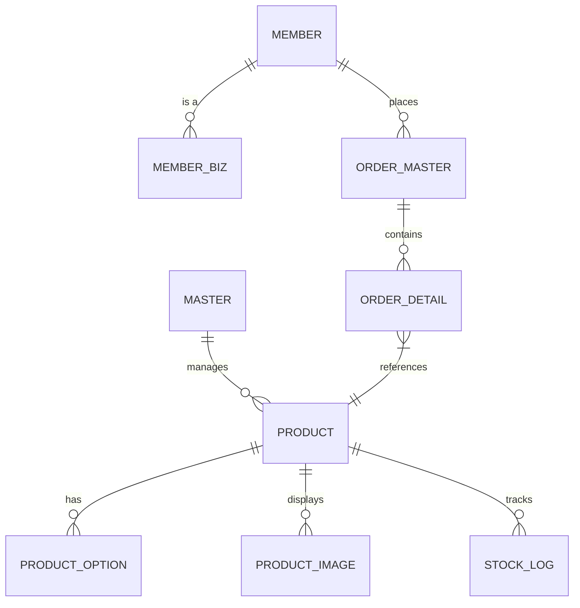

# 🛒 나눔 쇼핑몰 플랫폼 PRD (Product Requirements Document)
## 0. 공통 정책 (Common Policies)
### 0.1 통합 파일 관리 (Unified File Store)
- **목적**: 전사 도메인(상품, 배너, 팝업, 문의 등)의 파일 및 이미지를 중앙화된 테이블(`file_store`)에서 통합 관리.
- **주요 기능**:
  - `reference_type`과 `reference_id`를 통한 다형성 참조.
  - 대표 이미지(`is_main=Y`) 관리 및 트랜잭션 보장.
  - 파일 업로드 API(`POST /api/v1/files/upload`)를 통한 공통 처리.
- **마이그레이션**: 기존 분산된 이미지 정보(`product_image`, `thumbnail_url` 등)는 점진적으로 `file_store`로 통합 후 제거.

### 0.2 소프트 삭제 (Soft Delete)
- **적용 대상**: `product`, `content`, `inquiry`, `banner`, `popup`, `file_store`.
- **정책**:
  - 데이터 삭제 시 물리적 제거(Hard Delete) 대신 `delete_yn = 'Y'`, `deleted_at`, `deleted_by` 필드를 업데이트.
  - **사용자(User)**: `delete_yn = 'N'`인 활성 데이터만 조회 가능.
  - **관리자(Admin)**: `delete_yn` 상태와 관계없이 모든 데이터 조회 가능 (삭제된 데이터 포함).
  - **Cascading**: 상위 엔티티(예: 상품) 삭제 시 연관된 파일(`file_store`)도 소프트 삭제 처리.

**Version:** 1.0.0  
**Status:** Draft (Loki Mode Optimized)  
**Date:** 2026-02-02

---

## 1. 개요 (Overview)
나눔 쇼핑몰 플랫폼은 **"신뢰를 바탕으로 판매자와 구매자를 잇는 건강한 커머스 생태계 구축"**을 목표로 합니다. 기존 프로젝트의 안정적인 모듈러 구조를 재활용하여, 확장성 있는 B2C/B2B 하이브리드 커머스 엔진을 제공합니다.

---

## 2. 사용자 페르소나 (User Personas)

| 페르소나 | 주요 목적 | 핵심 가치 |
| :--- | :--- | :--- |
| **Master (관리자)** | 전체 시스템 상태 모니터링 및 정책 관리 | 운영 통제권 및 플랫폼 건전성 유지 |
| **Biz (기업회원)** | 대량 구매, 기업용 혜택 관리 및 임직원 쇼핑 | 기업 구매 효율화 및 비용 절감 |
| **Partner (입점사)** | 상품 직접 등록 및 판매 관리 (SCM) | 플랫폼을 통한 판로 확대 및 매출 증대 |
| **User (개인회원)** | 일반 상품 구매 및 원활한 쇼핑 환경 | 쇼핑 경험의 편의성 및 신뢰도 |

---

## 3. 핵심 기능 요구사항 (Core Functional Requirements)

### 3.1 🛍️ 상품 및 기업회원 전용관 (Product & Biz Special-Mall)
| Role | Feature | Description |
| :--- | :--- | :--- |
| **Master** | 상품 관리 | 카테고리 설정, 상품 등록/수정 및 기업 전용관 매핑. |
| **Master** | 재고 입출고 관리 | `inventory_history` 테이블을 통한 실시간 재고 흐름 추적 및 수기 조정. |
| **Biz** | 전용 상품 탐색 | 소속 기업에 매핑된 특가 상품 및 전용관 상품 조회. |
| **User** | 일반 상품 탐색 | 일반 사용자용 카테고리 상품 탐색 및 상세 조회. |

- **모듈러 카테고리 시스템**: 일반회원과 기업회원 전용 카테고리를 지원하는 유연한 구조.
- **기업 전용 상품 배치**: 특정 기업회원(Biz)만 접근 가능하거나 혜택이 적용되는 단독 상품 관리.
- **다이나믹 옵션 관리**: 기업 대량 구매를 고려한 수량별 단가 차등 및 번들 구성 기능.
- **이미지 최적화 스토리지**: 기업 BI 반영 및 고해상도 이미지를 위한 효율적인 관리 (Thumbnail + Detail Images).
- **상품 생명주기 관리**:
  - `SALE` (판매중): 정상 노출 및 구매 가능.
  - `STOP` (판매중지): 관리자에 의한 강제 노출 중단 (리스트 숨김).
  - `SOLD_OUT` (품절): 재고 소진 시 자동/수동 전환 (노출하되 구매 불가).
- **데이터 무결성 정책**: 상품 삭제 시 연관된 `Option` 및 `Image` 데이터는 Cascade(Hard Delete) 처리하며, 주문 내역이 있는 상품은 삭제를 제한하거나 Soft Delete(`delete_yn='Y'`) 처리.
- **찜하기(Wishlist)**: 사용자는 관심 상품을 찜 목록에 저장할 수 있으며, 중복 저장은 방지됨(Unique Key). 찜한 상품은 마이페이지에서 상세 정보와 함께 조회 가능.
- **장바구니 스마트 담기**:
  - 동일 상품(옵션 포함) 중복 시 즉시 합산하지 않고 **409 Conflict** 응답.
  - 사용자 Confirm 후 `forceUpdate: true` 요청 시 수량 합산.

### 3.2 🛒 기업 특화 주문 및 결제 (Biz-Optimized Order & Pay)
| Role | Feature | Description |
| :--- | :--- | :--- |
| **Biz** | 대량 주문 | 기업 단위 대량 구매 기능 및 전용 결제 수단 관리. |
| **User** | 개인 주문/결제 | 장바구니 담기, 일반 카드/포인트 결제. |
| **Master** | 주문 모니터링 | 전체 주문 현황 관리 및 배송 상태 일괄 업데이트. |
| **User** | 주문 내역 | 개인/부서별 주문 내역 조회 및 취소/환불 요청. |

- **대량 주문 인터페이스**: 기업 구매 담당자를 위한 엑셀 대량 업로드 및 대량 발주 시스템.
- **결제 오케스트레이션**: 법인 카드, 가상 계좌, 외상(미수금) 관리 등 기업 특화 결제수단 연동.
- **주문 상태 트래킹**: `결제대기` -> `결제완료` -> `상품준비` -> `배송중` -> `배송완료` -> `구매확정`의 표준 프로세스 유지.

### 3.3 🚚 배송 및 물류 (Delivery & Logistics)
| Role | Feature | Description |
| :--- | :--- | :--- |
| **Biz** | 부서별 주소록 | `dept_name` 필드를 활용한 부서/프로젝트별 다중 배송지 관리. |
| **User** | 개인 주소록 | 개인 배송지 등록/수정/삭제. |
| **Master** | 배송 업체 연동 | 운송장 번호 관리 및 배송 단계 추적. |

- **전 회원 다중 배송지 관리**: 모든 회원이 여러 개의 배송지(집, 회사, 프로젝트 장소 등)를 등록하고 배송지 테이블을 통해 관리하는 기능.
- **송장 연동 시스템**: 모든 회원에게 제공되는 표준 송장 관리 인터페이스 및 물류 파트너사 API 연동.

### 3.4 🎟️ 마케팅 및 리워드 (Benefit System)
| Role | Feature | Description |
| :--- | :--- | :--- |
| **Master** | 타겟 쿠폰 관리 | `target_type`(ALL, USER, BIZ)에 따른 대상 기반 쿠폰 발행. |
| **User/Biz** | 혜택 적용 | 보유 쿠폰 및 복지 포인트 적립/사용. |

- **정교한 쿠폰 엔진**: 정액/정율 할인, 유효기간, 중복 사용 방지 로직.
- **포인트 에코시스템**: 구매 적립, 사용 차감, 소멸 기능 (Reuse: Point).

### 3.5 👥 회원 시스템 (Member System)
| Role | Feature | Description |
| :--- | :--- | :--- |
| **All** | 인증 (Auth) | 로그인 (JWT), 회원가입. (아이디 중복 확인 API - 비로그인 접근 허용) |
| **Biz** | 기업 정보 관리 | 사업자 정보(`member_biz`) 연동 및 기업 인증 관리. |
| **Master** | 회원 관리 | 회원 유형별(User, Biz) 조회 및 관리, 승인 프로세스. |
| **Support** | 고객 지원 | 1:1 문의(Inquiry), 공지사항(Notice), FAQ 관리. (Master: 공지/답변 작성, User/Biz: 조회/문의).   - 배너/팝업 관리 기능 포함. |

---

## 4. 정보 아키텍처 (Information Architecture)

---

## 5. 비기능 요구사항 (Non-Functional Requirements)

- **보안 (Security)**:
  - JWT 기반의 무상태(Stateless) 인증 아키텍처 (Reuse: Auth).
  - SQL Injection 방지 및 민감 정보(비밀번호 등) 암호화 저장.
- **성능 (Performance)**:
  - 상품 검색 시 인덱싱 최적화.
  - 대용량 트래픽 대응을 위한 읽기/쓰기 분리 고려 (CQRS 준비).
- **유연성 (Flexibility)**:
  - 기존 Java/Spring Boot 기반의 Clean Architecture 구조 유지.
  - Gradle을 활용한 멀티 모듈 확장 가능성 확보.

---

## 6. 개발 로드맵 (Milestones)

1.  **Phase 1 (Foundational)**: 기존 프로젝트 모듈(Auth, Common) 연동 및 DB 스카폴딩 완료. (현재 진행 상태: 일부 완료)
2.  **Phase 2 (Core Commerce)**: 상품 등록, 주문 마스터, 기본 구매 프로세스 구축.
3.  **Phase 3 (Optimization & Marketing)**: 쿠폰 시스템, 검색 최적화, 판매자 정산 대시보드 고도화.

---

> [!IMPORTANT]
> 본 문서는 `loki-mode` 활성화 상태에서 작성되었으며, 기존 **나눔(Nanum)** 프로젝트의 구조적 장점을 최대화하도록 설계되었습니다.
