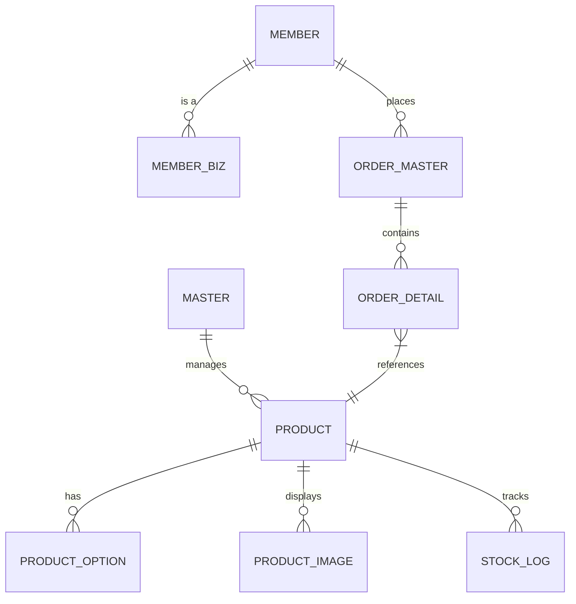

# 🛒 나눔 쇼핑몰 플랫폼 PRD (Product Requirements Document)
**Version:** 1.0.0  
**Status:** Draft (Loki Mode Optimized)  
**Date:** 2026-02-02

---

## 1. 프로젝트 비전 (Project Vision)
나눔 쇼핑몰 플랫폼은 **"신뢰를 바탕으로 판매자와 구매자를 잇는 건강한 커머스 생태계 구축"**을 목표로 합니다. 기존 프로젝트의 안정적인 모듈러 구조를 재활용하여, 확장성 있는 B2C/B2B 하이브리드 커머스 엔진을 제공합니다.

---

## 2. 사용자 페르소나 (User Personas)

| 페르소나 | 주요 목적 | 핵심 가치 |
| :--- | :--- | :--- |
| **Master (관리자)** | 전체 시스템 상태 모니터링 및 정책 관리 | 운영 통제권 및 플랫폼 건전성 유지 |
| **Biz (기업회원)** | 대량 구매, 기업용 혜택 관리 및 임직원 쇼핑 | 기업 구매 효율화 및 비용 절감 |
| **User (개인회원)** | 일반 상품 구매 및 원활한 쇼핑 환경 | 쇼핑 경험의 편의성 및 신뢰도 |

---

## 3. 핵심 기능 요구사항 (Core Functional Requirements)

### 3.1 🛍️ 상품 및 기업회원 전용관 (Product & Biz Special-Mall)
- **모듈러 카테고리 시스템**: 일반회원과 기업회원 전용 카테고리를 지원하는 유연한 구조.
- **기업 전용 상품 배치**: 특정 기업회원(Biz)만 접근 가능하거나 혜택이 적용되는 단독 상품 관리.
- **다이나믹 옵션 관리**: 기업 대량 구매를 고려한 수량별 단가 차등 및 번들 구성 기능.
- **이미지 최적화 스토리지**: 기업 BI 반영 및 고해상도 이미지를 위한 효율적인 관리.

### 3.2 🛒 기업 특화 주문 및 결제 (Biz-Optimized Order & Pay)
- **대량 주문 인터페이스**: 기업 구매 담당자를 위한 엑셀 대량 업로드 및 대량 발주 시스템.
- **결제 오케스트레이션**: 법인 카드, 가상 계좌, 외상(미수금) 관리 등 기업 특화 결제수단 연동.
- **주문 상태 트래킹**: `결제대기` -> `결제완료` -> `상품준비` -> `배송중` -> `배송완료` -> `구매확정`의 표준 프로세스 유지.

### 3.3 🚚 배송 및 물류 (Delivery & Logistics)
- **전 회원 다중 배송지 관리**: 모든 회원이 여러 개의 배송지(집, 회사, 프로젝트 장소 등)를 등록하고 배송지 테이블을 통해 관리하는 기능.
- **송장 연동 시스템**: 모든 회원에게 제공되는 표준 송장 관리 인터페이스 및 물류 파트너사 API 연동.

### 3.4 🎟️ 마케팅 및 리워드 (Benefit System)
- **정교한 쿠폰 엔진**: 정액/정율 할인, 유효기간, 중복 사용 방지 로직.
- **포인트 에코시스템**: 구매 적립, 사용 차감, 소멸 기능 (Reuse: Point).

---

## 4. 정보 아키텍처 (Information Architecture)

---

## 5. 비기능 요구사항 (Non-Functional Requirements)

- **보안 (Security)**:
  - JWT 기반의 무상태(Stateless) 인증 아키텍처 (Reuse: Auth).
  - SQL Injection 방지 및 민감 정보(비밀번호 등) 암호화 저장.
- **성능 (Performance)**:
  - 상품 검색 시 인덱싱 최적화.
  - 대용량 트래픽 대응을 위한 읽기/쓰기 분리 고려 (CQRS 준비).
- **유연성 (Flexibility)**:
  - 기존 Java/Spring Boot 기반의 Clean Architecture 구조 유지.
  - Gradle을 활용한 멀티 모듈 확장 가능성 확보.

---

## 6. 개발 로드맵 (Milestones)

1.  **Phase 1 (Foundational)**: 기존 프로젝트 모듈(Auth, Common) 연동 및 DB 스카폴딩 완료. (현재 진행 상태: 일부 완료)
2.  **Phase 2 (Core Commerce)**: 상품 등록, 주문 마스터, 기본 구매 프로세스 구축.
3.  **Phase 3 (Optimization & Marketing)**: 쿠폰 시스템, 검색 최적화, 판매자 정산 대시보드 고도화.

---

> [!IMPORTANT]
> 본 문서는 `loki-mode` 활성화 상태에서 작성되었으며, 기존 **나눔(Nanum)** 프로젝트의 구조적 장점을 최대화하도록 설계되었습니다.
